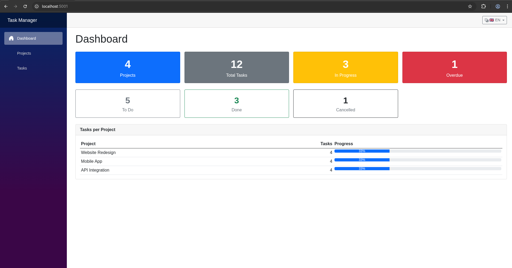
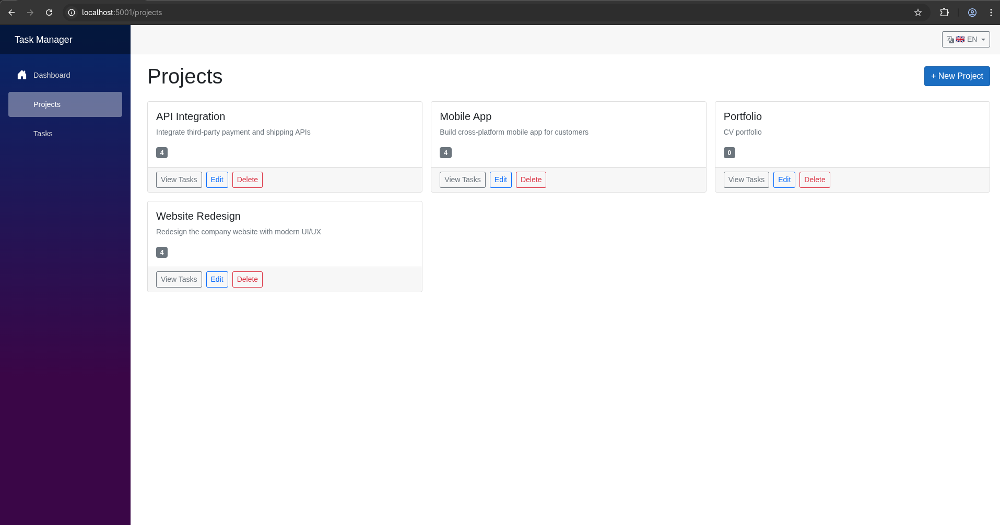
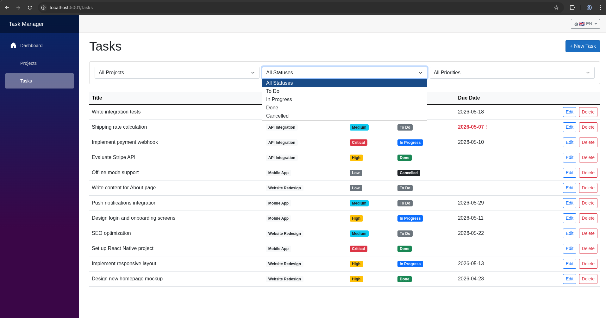
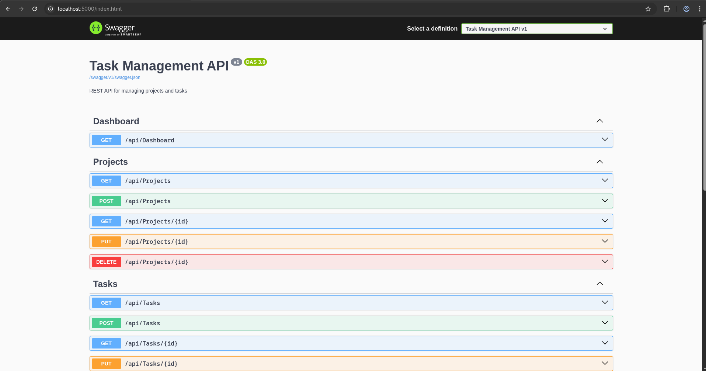
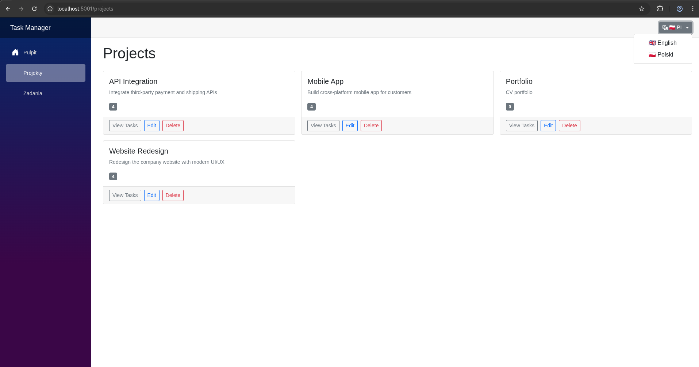

# Task Management System


A full-stack task management application built with **.NET 8**, demonstrating clean layered architecture, RESTful API design, and modern Blazor UI. Supports English and Polish 🇵🇱.

## Preview

| Dashboard | Projects |
|:---------:|:--------:|
|  |  |

| Tasks with filters | Swagger API |
|:-----------------:|:-----------:|
|  |  |

<details>
<summary>Polish language / Wersja polska 🇵🇱</summary>



</details>

## Tech Stack

| Layer | Technology |
|---|---|
| API | ASP.NET Core 8 Web API + Swagger |
| UI | Blazor Server (.NET 8) |
| ORM | Entity Framework Core 8 |
| Database | SQL Server 2022 |
| Testing | xUnit + FluentAssertions + EF InMemory |
| Containers | Docker + Docker Compose |

## Architecture

```
src/
├── TaskManagementSystem.Domain         # Entities, Enums — no dependencies
├── TaskManagementSystem.Application    # DTOs, Interfaces, Services
├── TaskManagementSystem.Infrastructure # EF Core DbContext, Migrations, Seed data
├── TaskManagementSystem.Api            # ASP.NET Core Web API (controllers)
└── TaskManagementSystem.Web            # Blazor Server UI

tests/
└── TaskManagementSystem.Tests          # xUnit unit tests (21 tests)

docs/
└── screenshots/                        # UI screenshots
```

**Dependency flow:** `Api` → `Infrastructure` → `Application` → `Domain`
The Web project calls the API over HTTP — fully decoupled.

## Features

- **Projects** — full CRUD with task count
- **Tasks** — full CRUD with priority, status, due date
- **Filtering** — by status, priority, and project
- **Dashboard** — live statistics: total counts, status breakdown, overdue tasks, tasks-per-project chart
- **Seed data** — 3 projects and 12 realistic tasks loaded on first run
- **Swagger UI** — interactive API docs at `http://localhost:5000`

## Running Locally

### Prerequisites

- [.NET 8 SDK](https://dotnet.microsoft.com/download/dotnet/8)
- [Docker Desktop](https://www.docker.com/products/docker-desktop/) (for SQL Server)

### Option 1 — Docker Compose (recommended)

```bash
# 1. Clone the repo
git clone https://github.com/PatrykStepienPro/TaskManagementSystem.git
cd TaskManagementSystem

# 2. Start everything
docker compose up --build

# API + Swagger:  http://localhost:5000
# Blazor UI:      http://localhost:5001
```

> First startup takes ~60 seconds while SQL Server initialises and the API applies migrations + seed data.

### Option 2 — Local .NET + Docker SQL Server

```bash
# 1. Start only SQL Server
docker compose up sqlserver -d

# 2. Run the API (Development config uses localhost:1433)
dotnet run --project src/TaskManagementSystem.Api

# 3. Run the Blazor UI (in a second terminal)
dotnet run --project src/TaskManagementSystem.Web

# API + Swagger:  http://localhost:5000
# Blazor UI:      http://localhost:5001
```

## Running Tests

```bash
dotnet test
```

Output:
```
Passed!  - Failed: 0, Passed: 21, Skipped: 0, Total: 21
```

## EF Core Migrations

```bash
# Add a new migration
dotnet ef migrations add <MigrationName> \
  --project src/TaskManagementSystem.Infrastructure \
  --startup-project src/TaskManagementSystem.Api

# Apply migrations manually (they also run automatically on startup)
dotnet ef database update \
  --project src/TaskManagementSystem.Infrastructure \
  --startup-project src/TaskManagementSystem.Api
```

## Environment Variables

| Variable | Default | Description |
|---|---|---|
| `ConnectionStrings__DefaultConnection` | *(see appsettings.Development.json)* | SQL Server connection string |
| `ApiBaseUrl` | `http://localhost:5000` | API URL used by Blazor Web |
| `SA_PASSWORD` | `YourStrong@Passw0rd` | SQL Server SA password (Docker) |

Copy `.env.example` to `.env` to override Docker Compose defaults:

```bash
cp .env.example .env
```

## API Reference

| Method | Endpoint | Description |
|---|---|---|
| GET | `/api/projects` | List all projects |
| POST | `/api/projects` | Create project |
| GET | `/api/projects/{id}` | Get project by id |
| PUT | `/api/projects/{id}` | Update project |
| DELETE | `/api/projects/{id}` | Delete project |
| GET | `/api/tasks?status=&priority=&projectId=` | List tasks with filters |
| POST | `/api/tasks` | Create task |
| GET | `/api/tasks/{id}` | Get task by id |
| PUT | `/api/tasks/{id}` | Update task |
| DELETE | `/api/tasks/{id}` | Delete task |
| GET | `/api/dashboard` | Dashboard statistics |

Full interactive docs available at `http://localhost:5000` (Swagger UI).

## Project Structure Details

```
src/TaskManagementSystem.Domain/
├── Entities/
│   ├── BaseEntity.cs
│   ├── Project.cs
│   └── TaskItem.cs
└── Enums/
    ├── Priority.cs
    └── TaskItemStatus.cs

src/TaskManagementSystem.Application/
├── DTOs/          (ProjectDto, TaskItemDto, DashboardStatsDto, ...)
├── Exceptions/    (NotFoundException)
├── Interfaces/    (IProjectService, ITaskService, IDashboardService, IAppDbContext)
└── Services/      (ProjectService, TaskService, DashboardService)

src/TaskManagementSystem.Infrastructure/
└── Data/
    ├── AppDbContext.cs
    ├── SeedData.cs
    └── Migrations/

src/TaskManagementSystem.Api/
├── Controllers/   (ProjectsController, TasksController, DashboardController)
├── Program.cs
└── Dockerfile

src/TaskManagementSystem.Web/
├── Components/Pages/  (Home.razor, Projects.razor, Tasks.razor)
├── Models/            (local DTOs mirroring API contracts)
├── Services/          (ApiClient.cs — typed HttpClient)
├── Program.cs
└── Dockerfile
```

## License

MIT
